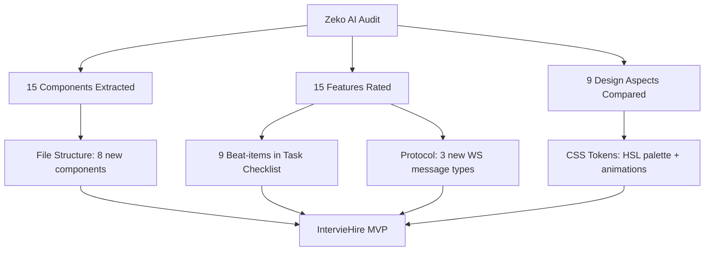
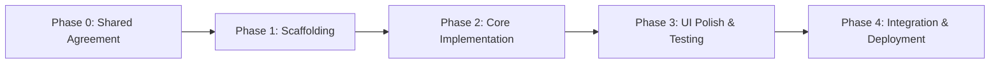
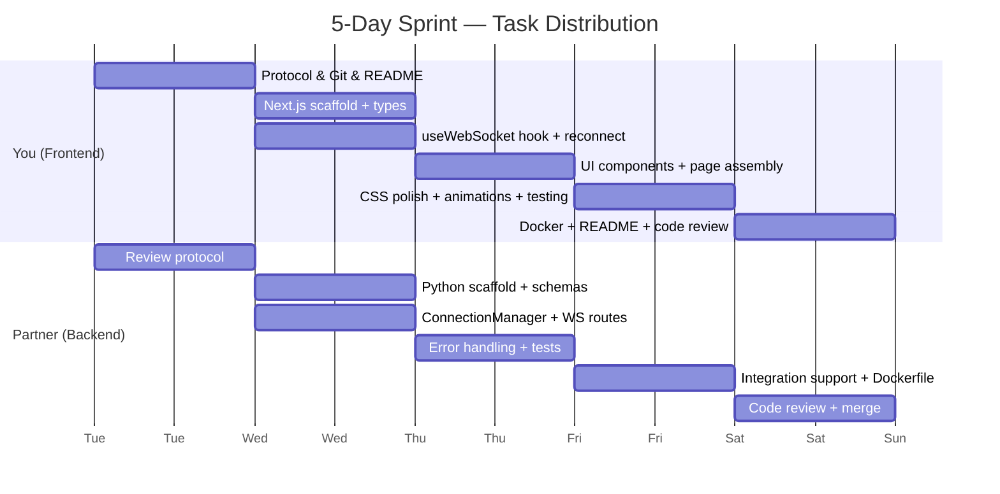
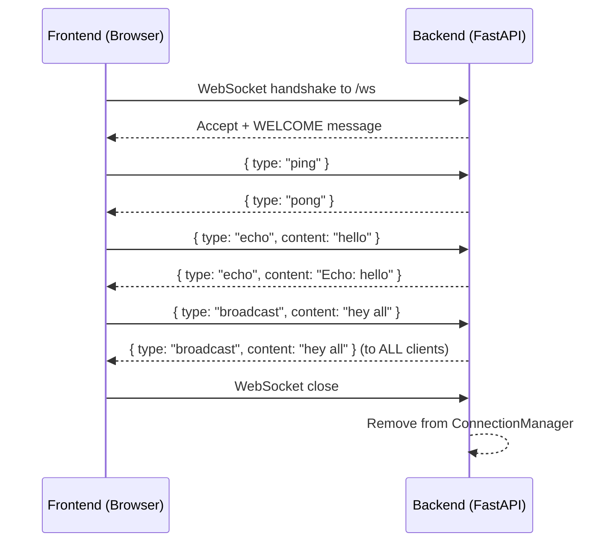

# Fullstack WebSocket Dashboard — Skill & Task Bifurcation

> **Project**: Real-time WebSocket Dashboard  
> **Stack**: Next.js (Frontend) + FastAPI (Backend) + WebSocket (Transport)  
> **Developers**: Frontend Developer (You) · Backend Developer (Partner)

---

## ⏱️ Timeline Configuration

> **Instructions**: Set the `TOTAL_DAYS` value below to match your sprint length.  
> The day-by-day schedule in this document auto-distributes across the number you choose.  
> Adjust the table if your pace differs.

```
┌─────────────────────────────────────────┐
│  TOTAL_DAYS  =  5                       │
│  HOURS/DAY   =  6  (effective coding)   │
│  START_DATE  =  2026-05-26 (Monday)     │
└─────────────────────────────────────────┘
```

### Phase-to-Day Mapping

| Phase | Name | Days Allocated | Calendar Days |
| :---: | :--- | :---: | :--- |
| 0 | Protocol & Config Agreement | **0.5** (half of Day 1) | Day 1 morning |
| 1 | Project Scaffolding | **0.5** (half of Day 1) | Day 1 afternoon |
| 2 | Core Implementation | **2** | Day 2 – Day 3 |
| 3 | UI Polish & Testing | **1** | Day 4 |
| 4 | Integration & Deployment | **1** | Day 5 |

> [!TIP]
> **Scaling Guide** — If you have more or fewer days, redistribute like this:
>
> | Total Days | Phase 0+1 | Phase 2 | Phase 3 | Phase 4 |
> | :---: | :---: | :---: | :---: | :---: |
> | **3 days** (rush) | 0.5 | 1 | 1 | 0.5 |
> | **5 days** (standard) | 1 | 2 | 1 | 1 |
> | **7 days** (comfortable) | 1 | 3 | 2 | 1 |
---

## 🔍 Competitive Analysis & Feature Extraction

> **Competitor**: Zeko AI — Enterprise-Grade AI for Strategic Hiring  
> **Our Product**: IntervieHire  
> **Audit Source**: Live dashboard at `app.zeko.ai` + marketing site at `zeko.ai`  
> **Audit Date**: 2026-05-26

### Configuration

```
┌──────────────────────────────────────────────────────────────────────────────────┐
│  COMPETITOR_URL   =  https://app.zeko.ai/app/role/responses                     │
│  COMPETITOR_NAME  =  Zeko AI                                                    │
│  OUR_PRODUCT      =  IntervieHire                                               │
│  AUDIT_DATE       =  2026-05-26                                                 │
│  AUDIT_METHOD     =  HTML/CSS source analysis of authenticated dashboard        │
└──────────────────────────────────────────────────────────────────────────────────┘
```

### Zeko Tech Stack (Discovered)

| Layer | Technology | Notes |
| :--- | :--- | :--- |
| Framework | **Next.js** (App Router) | SSR with client bailout, chunked JS bundles |
| UI Library | **Radix UI** primitives | Sidebar, menus, tooltips, toasts |
| Styling | **TailwindCSS** | Utility-first classes, `data-` attribute state variants |
| Icons | **Lucide React** | `lucide-briefcase`, `lucide-trending-up`, `lucide-users`, `lucide-settings` |
| State/Data | **React Query** | `ReactQueryDevtools` included in production bundle |
| Analytics | **Google Analytics** (`G-VQPDLPYZ3N`) + **PostHog** + **Microsoft Clarity** | Triple tracking stack |
| Font (App) | **DM Sans** | Applied globally via `--font-dm-sans` CSS variable |
| Font (Marketing) | **Be Vietnam Pro**, Figtree, Poppins, Inter | Marketing site uses Framer |
| Auth | Custom (cookie-based) | `PlanProvider`, `PermissionsProvider` context wrappers |
| Consent | **Silktide** cookie banner | Cookie types: Necessary, Analytical, Advertising |

---

### Extracted Components (from Zeko Dashboard)

| # | Component Name | What Zeko Has | Quality | Our Strategy (IntervieHire) | Owner |
| :---: | :--- | :--- | :---: | :---: | :--- |
| 1 | `CollapsibleSidebar` | Left sidebar with icon-only collapsed mode (`data-collapsible="icon"`), 4 nav items, toggle rail button. Smooth width transition via `transition-[width] duration-200 ease-linear`. | ⭐⭐⭐⭐ | 🔥 **Beat** — add glassmorphism sidebar bg, animated active indicator with sliding pill, smooth hover glow on items | **You** |
| 2 | `SidebarNavItem` | Menu items with Lucide icons, `data-active` state, hover → `bg-slate-100`, active → `bg-primary-100 text-primary-700 font-medium`. Truncated text for collapsed mode. | ⭐⭐⭐ | 🔥 **Beat** — add tooltip on collapsed hover, animated icon color transitions, subtle badge for counts | **You** |
| 3 | `UserProfileCard` | Sidebar footer: gradient avatar (`bg-gradient-to-br from-primary-400 to-primary-600`), user name, company name, chevron-right expand icon. Has `aria-haspopup="menu"`. | ⭐⭐⭐ | 🔥 **Beat** — add real avatar image support, online status dot, animated dropdown with logout/settings/profile options | **You** |
| 4 | `SidebarToggleRail` | Invisible 5px rail on the sidebar edge for drag-to-collapse. Cursor changes based on state (`cursor-w-resize` / `cursor-e-resize`). | ⭐⭐⭐ | ✅ **Match** — implement same resize rail pattern, add visual grab indicator on hover | **You** |
| 5 | `MainContentArea` | Rounded-lg border container with `bg-gray-50`, `border-slate-300/50`. Adapts margin when sidebar collapses. | ⭐⭐⭐ | 🔥 **Beat** — glassmorphism main container with subtle inner glow, smooth margin transitions | **You** |
| 6 | `SkeletonLoader` | Pulse animation loading placeholders (`animate-pulse bg-muted rounded-md`). Uses a 2x3 grid of cards (h-32 each) with heading skeleton (h-8) and subtitle skeleton (h-4). | ⭐⭐ | 🔥 **Beat** — custom shimmer gradient animation instead of opacity pulse, staggered card reveal, skeleton-to-content morph transition | **You** |
| 7 | `ResponsesTable` | Data table for candidate responses (on `/role/responses` page). Tab-based filtering via `tabType` query param. | ⭐⭐⭐ | 🔥 **Beat** — add real-time WebSocket updates for new responses, virtual scrolling for large datasets, inline expand for details, row hover highlight with slide-in actions | **You** + Partner |
| 8 | `ToastNotifications` | Radix-based toast system in bottom-right (`sm:bottom-0 sm:right-0`), max-width 420px. Region labeled "Notifications (F8)". | ⭐⭐⭐ | 🔥 **Beat** — WebSocket-powered real-time toasts (not just action confirmations), categorized by type with distinct icons/colors, stack with auto-dismiss timers | **You** + Partner |
| 9 | `RoleLayout` | Nested layout for `/role/*` routes. Wraps all role-related pages with shared context. | ⭐⭐⭐ | ✅ **Match** — implement role-specific layout with shared header/breadcrumbs | **You** |
| 10 | `TabNavigation` | Tab filtering on responses page (referenced via `tabType` URL param). Tabs are likely role-specific interview stages. | ⭐⭐⭐ | 🔥 **Beat** — animated tab underline indicator, smooth tab content transitions, tab counts with live WebSocket updates | **You** |
| 11 | `CookieConsentBanner` | Silktide-based, positioned `bottomCenter`, categories: Necessary/Analytical/Advertising. Custom "Manage Preferences" flow. | ⭐⭐ | ⏭️ **Skip (MVP)** — implement later for production compliance | — |
| 12 | `JobsPage` | Main landing at `/app/role` — likely lists open job roles/positions | ⭐⭐⭐ | 🔥 **Beat** — card-based job listing with status badges, real-time applicant count, quick actions | **You** |
| 13 | `UsageOverviewPage` | Analytics/usage page at `/app/usage` — likely shows API usage, interview counts, quota | ⭐⭐⭐ | 🔥 **Beat** — live-updating charts via WebSocket, animated counters, trend sparklines | **You** + Partner |
| 14 | `TeamAccessPage` | Team management at `/app/team` — manage team member access and roles | ⭐⭐⭐ | ✅ **Match** — role-based access table with invite flow | **You** |
| 15 | `SettingsPage` | Gear icon in sidebar (button, not link — `<button>` not `<a>`), likely opens modal or nested menu | ⭐⭐ | ⏭️ **Skip (MVP)** — implement in v2 | — |

---

### Feature Audit Matrix

| Feature | Zeko Has It? | Zeko Quality | IntervieHire Target | Improvement Strategy |
| :--- | :---: | :---: | :---: | :--- |
| Collapsible sidebar navigation | ✅ Yes | ⭐⭐⭐⭐ | ⭐⭐⭐⭐⭐ | Glassmorphism bg, animated active pill, tooltips in collapsed mode |
| Candidate response tracking | ✅ Yes (table + tabs) | ⭐⭐⭐ | ⭐⭐⭐⭐⭐ | Real-time WebSocket updates, virtual scrolling, inline expand |
| Skeleton loading states | ✅ Yes (pulse animation) | ⭐⭐ | ⭐⭐⭐⭐⭐ | Shimmer gradient, staggered reveal, skeleton-to-content morph |
| Toast notifications | ✅ Yes (Radix) | ⭐⭐⭐ | ⭐⭐⭐⭐⭐ | WebSocket-powered real-time alerts, categorized with icons |
| Role-based access control | ✅ Yes (`PermissionsProvider`) | ⭐⭐⭐ | ⭐⭐⭐⭐ | Granular permission UI, role hierarchy visualization |
| Plan/subscription management | ✅ Yes (`PlanProvider`) | ⭐⭐⭐ | ⭐⭐⭐⭐ | Clear plan comparison, usage meters, upgrade prompts |
| Dark mode | ❌ No (light only, `bg-gray-50`) | — | ⭐⭐⭐⭐⭐ | Premium dark-first theme, HSL palette, glassmorphism |
| Real-time WebSocket updates | ❌ No (React Query polling) | — | ⭐⭐⭐⭐⭐ | Native WebSocket for instant updates across all data views |
| Keyboard shortcuts | ❌ No | — | ⭐⭐⭐⭐ | `Ctrl+K` command palette, `Ctrl+Enter` submit, `Esc` close |
| Mobile responsive sidebar | ❌ Partial (hidden on mobile `hidden md:block`) | ⭐⭐ | ⭐⭐⭐⭐⭐ | Slide-out drawer on mobile, swipe gesture support |
| Animated transitions | ❌ Minimal (only sidebar width + skeleton pulse) | ⭐⭐ | ⭐⭐⭐⭐⭐ | Page transitions, card hover effects, staggered list animations |
| Usage analytics dashboard | ✅ Yes (`/app/usage`) | ⭐⭐⭐ | ⭐⭐⭐⭐⭐ | Live charts via WebSocket, animated counters, trend sparklines |
| Team management | ✅ Yes (`/app/team`) | ⭐⭐⭐ | ⭐⭐⭐⭐ | Invite flow, role hierarchy, activity log |
| Cookie consent | ✅ Yes (Silktide) | ⭐⭐ | ⏭️ Skip (MVP) | Implement for production launch |
| AI-driven interviews | ✅ Yes (core product) | ⭐⭐⭐⭐ | ⭐⭐⭐⭐⭐ | Better AI feedback UI, real-time interview progress via WebSocket |

---

### 🏆 Beat-the-Competition Improvement Plan

| Zeko's Feature | Their Weakness | IntervieHire Upgrade | Files Affected | Owner | Day |
| :--- | :--- | :--- | :--- | :--- | :---: |
| React Query polling for data | Not real-time — stale data between polls, unnecessary network requests | Native WebSocket push for all data updates — instant, no polling overhead | `hooks/useWebSocket.ts`, `backend/websocket_routes.py` | **You** + Partner | Day 2 |
| `animate-pulse` skeleton loader | Basic opacity blink, all cards load simultaneously, no delight | Shimmer gradient sweep + staggered card reveal + skeleton-to-content morph transition | `components/SkeletonLoader.tsx`, `page.module.css` | **You** | Day 3 |
| Light-only theme (`bg-gray-50`) | No dark mode option, harsh on eyes during extended use | Dark-first premium theme with HSL-tuned deep slates and glassmorphism cards | `globals.css`, `page.module.css` | **You** | Day 4 |
| Sidebar hidden on mobile (`hidden md:block`) | Entire navigation disappears on mobile — users stuck | Slide-out drawer with swipe gesture, hamburger trigger, backdrop overlay | `components/Sidebar.tsx`, `hooks/useMediaQuery.ts` | **You** | Day 3 |
| No animated transitions between states | Abrupt content changes, no visual continuity | Page transitions, card hover lift effects, staggered list entry animations | `globals.css`, `page.module.css`, all components | **You** | Day 4 |
| DM Sans font (single font family) | Functional but generic — same weight/style everywhere | Inter/Outfit with modular type scale (6 sizes), distinct heading vs body weights | `globals.css`, `layout.tsx` | **You** | Day 1 |
| Radix toast (action confirmations only) | Only shows on user actions — no real-time server push | WebSocket-powered toasts for new candidates, interview completions, team updates | `components/ToastSystem.tsx`, `hooks/useWebSocket.ts` | **You** + Partner | Day 3 |
| Flat TailwindCSS cards (`bg-muted`, borders) | Functional but flat, no depth or visual hierarchy | Glassmorphism: `backdrop-filter: blur(14px)`, `rgba` borders, layered box-shadows, hover lift | `page.module.css` | **You** | Day 4 |
| No keyboard navigation | Mouse-only interaction, power users slowed down | `Ctrl+K` command palette, `Ctrl+Enter` submit, arrow key nav in tables | `components/CommandPalette.tsx`, `app/page.tsx` | **You** | Day 3 |

---

### 🎨 Design Teardown (Zeko vs IntervieHire)

| Aspect | Zeko Does | IntervieHire Will Do Better |
| :--- | :--- | :--- |
| **Typography** | DM Sans globally via CSS variable, single weight emphasis | Inter/Outfit with modular type scale (`--text-xs` to `--text-3xl`), distinct heading weight (700) vs body (400), monospace for data values |
| **Color Palette** | TailwindCSS defaults — `slate-100`, `gray-50`, `primary-100/400/600/700` (blue-ish). No custom palette tuning. | HSL-tuned dark palette: base `hsl(220,25%,8%)`, surface `hsl(220,20%,13%)`, violet accent `hsl(260,80%,65%)`, emerald status `hsl(155,80%,45%)`, amber warning `hsl(35,95%,55%)` |
| **Spacing** | TailwindCSS defaults (p-3, p-4, p-6, gap-2, gap-3). Inconsistent — sidebar uses p-6 header, p-4 content. | 4px base unit grid with CSS custom properties (`--space-1` through `--space-12`), consistent padding rules across all components |
| **Cards/Containers** | Flat `bg-muted` with `rounded-md`, basic borders. Main area has `border-slate-300/50 bg-gray-50`. | Glassmorphism: `backdrop-filter: blur(14px)`, `background: rgba(255,255,255,0.04)`, `border: 1px solid rgba(255,255,255,0.08)`, layered `box-shadow` with spread |
| **Sidebar** | Clean collapsible design with `--sidebar-width: 16.25rem`, icon mode `4.25rem`. Active state = `bg-primary-100 text-primary-700`. | Glassmorphism sidebar with translucent bg, animated sliding pill for active state, hover glow effect, tooltip labels in collapsed mode |
| **Animations** | Minimal: sidebar `transition-[width] duration-200 ease-linear`, skeleton `animate-pulse`. No page or component transitions. | Rich micro-interactions: 200ms ease-out on all state changes, `fadeInSlideUp` for list items, button hover scale(1.02) + glow, page transitions, status pulse `@keyframes` |
| **Loading States** | `animate-pulse` opacity blink on gray rectangles. All load simultaneously. | Shimmer gradient sweep left-to-right, staggered card reveal with 100ms delay between items, smooth skeleton-to-content crossfade |
| **Responsiveness** | Sidebar `hidden md:block` — completely gone on mobile. Content fills full width. | Slide-out drawer with swipe support on mobile, responsive grid `auto-fit/minmax`, touch targets ≥44px, stacked layout under 768px |
| **Accessibility** | `aria-hidden` on icons, `aria-label="Toggle Sidebar"`, `aria-haspopup="menu"` on profile. Basic but present. | Full WCAG AA: `aria-live` regions for real-time updates, `focus-visible` outlines, keyboard navigation for all interactive elements, contrast ratio ≥ 4.5:1 |

---

### How This Feeds Into the Build

> [!NOTE]
> The Zeko competitive audit directly shapes these sections of the skill file:
>
> **File Structure** → Components like `Sidebar`, `SkeletonLoader`, `CommandPalette`, `ToastSystem` are added to `/frontend/src/components/`.
> **Task Checklists** → Each "Beat" item above maps to a specific task with day assignment.
> **CSS Design** → The design teardown defines exact CSS custom properties, animation keyframes, and glassmorphism values.
> **Protocol** → Real-time features require expanded WebSocket message types (e.g. `candidate_update`, `interview_complete`, `usage_change`).



---

## 👥 Role Definitions

| Role | Person | Core Scope |
| :--- | :--- | :--- |
| **Frontend Developer** | **You** | UI/UX, state management, WebSocket client lifecycle, CSS/animations, shared config, environment setup, integration testing, deployment orchestration, documentation |
| **Backend Developer** | Partner | HTTP endpoints, WebSocket server protocol, connection management, data validation, server-side logging |

> **Learning Goal**: You (Frontend) own most cross-cutting and shared responsibilities. This means you'll touch backend config, deployment, testing glue, and protocol design — not just React components.

---

## 🔀 Execution Phases & Dependencies

Tasks are ordered in phases. A phase cannot start until the previous one is complete.



| Phase | Name | Blocking? | Owner |
| :---: | :--- | :--- | :--- |
| 0 | Protocol & Config Agreement | Yes — nothing starts without this | **You (Frontend)** draft, Partner reviews |
| 1 | Project Scaffolding | Yes — code depends on skeleton | Each owns their workspace |
| 2 | Core Implementation | Parallel — both can work independently | Split |
| 3 | UI Polish & Integration Testing | Partially parallel | **You (Frontend)** drives |
| 4 | Deployment & Documentation | Sequential | **You (Frontend)** leads |

---

## 📅 Day-by-Day Schedule

### Day 1 — Agreement + Scaffolding

> **Goal**: End the day with both projects running empty shells and a locked-in protocol.

| Time Block | You (Frontend) | Partner (Backend) |
| :--- | :--- | :--- |
| **Morning (3h)** | Draft WebSocket protocol schemas (the tables below). Write `.gitignore`, init Git repo, create branch strategy. Draft `README.md` with architecture diagram. | Review protocol schemas. Flag any missing error codes or payload fields. |
| **Afternoon (3h)** | Initialize Next.js (`create-next-app`), set up `globals.css` design tokens + Google Fonts, create `.env.local`, write `src/types/websocket.ts` type definitions. | Initialize `backend/` directory, create virtual env, `requirements.txt`, `app/config.py`, `app/schemas.py` (Pydantic models matching protocol). |
| **EOD Checkpoint** | ✅ `npm run dev` shows styled blank page. Types match protocol. Repo has first commit. | ✅ `uvicorn main:app` starts. Schemas validate sample payloads. |

---

### Day 2 — Core Implementation (Part 1)

> **Goal**: WebSocket hook works end-to-end. Backend accepts and echoes messages.

| Time Block | You (Frontend) | Partner (Backend) |
| :--- | :--- | :--- |
| **Morning (3h)** | Build `useWebSocket` hook — lifecycle, `connect()`, `disconnect()`, `send()`, state tracking (`CONNECTING` / `CONNECTED` / `DISCONNECTED`). | Implement `ConnectionManager` — `connect()`, `disconnect()`, `broadcast()`, `send_personal()` methods. |
| **Afternoon (3h)** | Add auto-reconnect with exponential backoff (base 1s, max 30s, jitter). Test with a local mock echo server (`npx wscat`). Build `StatusIndicator` component (pulsing dot). | Implement `websocket_routes.py` — receive JSON, route by `type`, handle `ping`/`echo`/`broadcast`. Wire into `main.py` with CORS. |
| **EOD Checkpoint** | ✅ Hook connects, sends, receives, auto-reconnects. StatusIndicator changes color on status change. | ✅ `GET /` returns health. WS endpoint echoes messages. Broadcast works with multiple `wscat` clients. |

---

### Day 3 — Core Implementation (Part 2)

> **Goal**: All UI components built and wired into the dashboard page.

| Time Block | You (Frontend) | Partner (Backend) |
| :--- | :--- | :--- |
| **Morning (3h)** | Build `MessageInput` (text + send, disabled when disconnected), `ConnectionControls` (connect/disconnect/ping buttons with disabled states). | Add error payload handling — unknown `type` returns `{ type: "error", code: 4001 }`. Add `timestamp` to all outgoing messages. |
| **Afternoon (3h)** | Build `LogEntry` (timestamp + direction badge ↑↓ + type badge + content) and `LogsPanel` (scrollable feed, auto-scroll to bottom). Assemble everything in `page.tsx`. | Write backend tests — `test_http.py` (health check), `test_websocket.py` (connect, echo roundtrip, broadcast, error on unknown type). |
| **EOD Checkpoint** | ✅ Dashboard renders all components. Connecting to backend shows messages flowing in logs panel. | ✅ `pytest` passes all tests. Error handling verified. |

---

### Day 4 — UI Polish & Testing

> **Goal**: Dashboard looks premium. All edge cases handled.

| Time Block | You (Frontend) | Partner (Backend) |
| :--- | :--- | :--- |
| **Morning (3h)** | Premium CSS in `page.module.css` — dark mode palette (HSL deep slates, violet accents, neon green status), glassmorphism cards (`backdrop-filter: blur(14px)`, `rgba` borders), responsive grid (sidebar + main ≥768px, stacked mobile). | Review frontend PR for protocol compliance. Fix any backend bugs found during integration. |
| **Afternoon (3h)** | Micro-animations — button hover scale+glow, log entry `fadeInSlideUp` with stagger, status pulse `@keyframes`, connection state color crossfade. Run integration test: connect → echo → broadcast → disconnect → reconnect. Error test: send bad payload, kill backend, verify UI states. | Support integration testing. Verify server logs match expected lifecycle events. Create `Dockerfile` for backend. |
| **EOD Checkpoint** | ✅ Dashboard looks premium at 1440px and 375px. All animations 60fps. All integration flows pass. Edge cases show correct UI. | ✅ Backend Dockerfile builds and runs. All server-side lifecycle logs verified. |

---

### Day 5 — Deployment & Documentation

> **Goal**: One command starts everything. README is complete. Code reviewed.

| Time Block | You (Frontend) | Partner (Backend) |
| :--- | :--- | :--- |
| **Morning (3h)** | Write `Dockerfile` for frontend (multi-stage Node image). Write `docker-compose.yml` linking both services. Test `docker compose up`. | Review `docker-compose.yml`. Verify backend container starts correctly inside compose network. |
| **Afternoon (3h)** | Finalize `README.md` — setup with/without Docker, architecture diagram, screenshot of dashboard. Final code review of partner's backend code. | Final code review of your frontend code. Merge all branches to `main`. |
| **EOD Checkpoint** | ✅ `docker compose up` from fresh clone works. README is self-sufficient. All PRs merged. | ✅ Backend code approved. Clean `main` branch. |

---

## 📊 Daily Effort Distribution



---

## 📁 File System Bifurcation

### Backend Workspace (`/backend`) — Partner Owns

```
backend/
├── .env                          # Server-side env vars (PORT, LOG_LEVEL)
├── requirements.txt              # Python deps: fastapi, uvicorn, python-dotenv
├── Dockerfile                    # Container image for the API
├── main.py                       # App entrypoint, CORS, router mounts
├── app/
│   ├── __init__.py
│   ├── config.py                 # Reads .env, exposes settings dataclass
│   ├── websocket_manager.py      # ConnectionManager: connect/disconnect/broadcast
│   ├── websocket_routes.py       # @app.websocket("/ws") handler logic
│   └── schemas.py                # Pydantic models for WS payloads
└── tests/
    ├── __init__.py
    ├── test_http.py              # Smoke tests for GET /
    └── test_websocket.py         # WS connect/echo/broadcast tests
```

| File | Purpose | Owner |
| :--- | :--- | :--- |
| `.env` | `PORT=8000`, `LOG_LEVEL=info`, `ALLOWED_ORIGINS=http://localhost:3000` | **Backend Dev** |
| `requirements.txt` | `fastapi`, `uvicorn[standard]`, `python-dotenv`, `pytest`, `httpx` | **Backend Dev** |
| `Dockerfile` | Multi-stage Python image, runs uvicorn | **Backend Dev** creates, **You** review |
| `main.py` | Mounts CORS, includes WS router, serves health check | **Backend Dev** |
| `app/config.py` | Pydantic `Settings` class reading from `.env` | **Backend Dev** |
| `app/websocket_manager.py` | `ConnectionManager` with `connect()`, `disconnect()`, `broadcast()`, `send_personal()` | **Backend Dev** |
| `app/websocket_routes.py` | Receives JSON, routes by `type`, delegates to manager | **Backend Dev** |
| `app/schemas.py` | `IncomingMessage`, `OutgoingMessage` Pydantic models | **Backend Dev** writes, **You** review (must match protocol) |
| `tests/*` | Unit & integration tests for HTTP and WS endpoints | **Backend Dev** |

---

### Frontend Workspace (`/frontend`) — You Own

```
frontend/
├── .env.local                    # NEXT_PUBLIC_WS_URL=ws://localhost:8000/ws
├── package.json
├── tsconfig.json
├── next.config.ts
├── public/
│   └── favicon.ico
├── src/
│   ├── types/
│   │   └── websocket.ts          # Shared TS interfaces: WSMessage, WSStatus, etc.
│   ├── lib/
│   │   └── constants.ts          # WS_URL, RECONNECT_INTERVAL, MAX_RETRIES
│   ├── hooks/
│   │   └── useWebSocket.ts       # Core WS hook: connect, send, auto-reconnect
│   ├── components/
│   │   ├── StatusIndicator.tsx    # Pulsing dot: green/amber/red
│   │   ├── MessageInput.tsx      # Text input + send button
│   │   ├── LogEntry.tsx          # Single log row with timestamp + badge
│   │   ├── LogsPanel.tsx         # Scrollable feed of LogEntry items
│   │   └── ConnectionControls.tsx# Connect/Disconnect/Ping buttons
│   ├── app/
│   │   ├── layout.tsx            # Root layout, Google Fonts (Inter), metadata
│   │   ├── page.tsx              # Main dashboard: assembles all components
│   │   ├── globals.css           # CSS reset, custom properties, font imports
│   │   └── page.module.css       # Dashboard-specific glassmorphism styles
│   └── __tests__/
│       └── useWebSocket.test.ts  # Unit test for the WS hook
└── Dockerfile                    # Multi-stage Node image, runs next start
```

| File | Purpose | Owner |
| :--- | :--- | :--- |
| `.env.local` | `NEXT_PUBLIC_WS_URL=ws://localhost:8000/ws` | **You** |
| `src/types/websocket.ts` | `IncomingMessage`, `OutgoingMessage`, `ConnectionStatus` TS types | **You** (must mirror backend schemas) |
| `src/lib/constants.ts` | `WS_URL`, `RECONNECT_BASE_DELAY`, `MAX_RECONNECT_ATTEMPTS` | **You** |
| `src/hooks/useWebSocket.ts` | `useWebSocket()` — manages `WebSocket` instance, exposes `status`, `messages`, `send()`, `connect()`, `disconnect()` | **You** |
| `src/components/*` | Reusable UI atoms — each focused on one job | **You** |
| `src/app/page.tsx` | Composes components into the dashboard layout | **You** |
| `src/app/globals.css` | Design tokens (colors, spacing, fonts), CSS reset | **You** |
| `src/app/page.module.css` | Glassmorphism cards, grid layout, animations | **You** |
| `Dockerfile` | Containerizes the Next.js app | **You** |

---

### Shared / Cross-Cutting Files — You Own

```
/ (project root)
├── docker-compose.yml            # Runs both services together
├── .gitignore                    # Covers node_modules, __pycache__, .env, etc.
├── README.md                     # Setup instructions, architecture diagram
└── skill.md                      # This file
```

| File | Purpose | Owner |
| :--- | :--- | :--- |
| `docker-compose.yml` | Defines `frontend` and `backend` services, links ports | **You** |
| `.gitignore` | Ignores build artifacts, envs, caches for both stacks | **You** |
| `README.md` | Project overview, setup steps, architecture diagram | **You** |

---

## 🔌 WebSocket Communication Protocol

> **Owner**: **You** draft this contract. Backend Dev implements to match it.

### Connection Flow



### Message Schemas

#### Client → Server

| Field | Type | Required | Description |
| :--- | :--- | :---: | :--- |
| `type` | `"ping"` ∣ `"echo"` ∣ `"broadcast"` | ✅ | Action the server should take |
| `content` | `string` | For `echo` and `broadcast` | The message body |

#### Server → Client

| Field | Type | Always Present | Description |
| :--- | :--- | :---: | :--- |
| `type` | `"welcome"` ∣ `"pong"` ∣ `"echo"` ∣ `"broadcast"` ∣ `"status"` ∣ `"error"` | ✅ | Response category |
| `content` | `string` | ✅ | Response body |
| `timestamp` | `string` (ISO 8601) | ✅ | Server-generated UTC timestamp |
| `sender` | `string` | ❌ | Identifier of the originating client (for broadcasts) |

#### Error Payload (Server → Client)

| Field | Type | Description |
| :--- | :--- | :--- |
| `type` | `"error"` | Always `"error"` |
| `code` | `number` | Application error code (e.g. `4001` = invalid payload, `4002` = rate limited) |
| `content` | `string` | Human-readable error description |
| `timestamp` | `string` | ISO 8601 UTC |

---

## 📋 Phase-by-Phase Task Checklists

### Phase 0 — Shared Agreement ✍️

> **Owner: You (Frontend)**. Draft everything, get Partner to sign off.  
> **Schedule: Day 1 Morning**

- [ ] **Define WebSocket protocol** (message schemas above)
  - *Done when*: Both devs have reviewed and agreed on the tables above
- [ ] **Agree on environment variables**
  - Backend: `PORT`, `LOG_LEVEL`, `ALLOWED_ORIGINS`
  - Frontend: `NEXT_PUBLIC_WS_URL`
  - *Done when*: `.env.example` files exist in both workspaces
- [ ] **Set up Git repository**
  - Init repo, create `.gitignore`, establish branch strategy
  - Convention: `feature/fe-*` for your branches, `feature/be-*` for partner
  - *Done when*: Repo exists with `main` branch, `.gitignore` committed
- [ ] **Create project README.md**
  - Architecture diagram, setup instructions, port assignments
  - *Done when*: A new dev could clone and run both services from the README alone

---

### Phase 1 — Scaffolding 🏗️

> **Schedule: Day 1 Afternoon**

#### You (Frontend)

- [ ] **Initialize Next.js project**
  - `npx -y create-next-app@latest ./frontend` with TypeScript, App Router, no Tailwind
  - *Done when*: `npm run dev` serves the default page on `localhost:3000`
- [ ] **Set up design tokens in `globals.css`**
  - CSS custom properties for colors, spacing, radii, shadows, fonts
  - Import Google Font (Inter or Outfit)
  - *Done when*: A blank page renders with the custom font and dark background
- [ ] **Create `.env.local`**
  - `NEXT_PUBLIC_WS_URL=ws://localhost:8000/ws`
  - *Done when*: `process.env.NEXT_PUBLIC_WS_URL` resolves in the browser console
- [ ] **Create type definitions** in `src/types/websocket.ts`
  - *Done when*: TS interfaces match the protocol tables exactly

#### Backend Dev (Partner)

- [ ] **Initialize Python project**
  - Create `backend/` dir, virtual environment, `requirements.txt`
  - *Done when*: `uvicorn main:app --reload` starts without errors
- [ ] **Create config module** (`app/config.py`)
  - *Done when*: Settings load from `.env` with fallback defaults
- [ ] **Create Pydantic schemas** (`app/schemas.py`)
  - *Done when*: Schemas match the protocol tables, validated with sample data

---

### Phase 2 — Core Implementation ⚙️

> Both devs work in **parallel**. The protocol contract from Phase 0 ensures compatibility.  
> **Schedule: Day 2 – Day 3**

#### You (Frontend)

- [ ] **Build `useWebSocket` hook** (`src/hooks/useWebSocket.ts`) — **Day 2 Morning**
  - Manage `WebSocket` instance lifecycle via `useRef`
  - Expose: `status`, `messages[]`, `send()`, `connect()`, `disconnect()`
  - Auto-reconnect with exponential backoff (base 1s, max 30s, jitter)
  - *Done when*: Hook connects to a mock WS echo server (`wscat` or `ws` npm package) and displays messages in console
- [ ] **Build `StatusIndicator` component** — **Day 2 Afternoon**
  - Green pulse = connected, amber pulse = connecting, red solid = disconnected
  - *Done when*: Component reactively changes color based on a `status` prop
- [ ] **Build `MessageInput` component** — **Day 3 Morning**
  - Text field + send button, disabled when disconnected
  - *Done when*: `onSend(content)` callback fires with trimmed input, field clears
- [ ] **Build `ConnectionControls` component** — **Day 3 Morning**
  - Connect / Disconnect / Ping buttons, context-aware disabled states
  - *Done when*: Buttons toggle correctly, ping sends `{ type: "ping" }`
- [ ] **Build `LogEntry` component** — **Day 3 Afternoon**
  - Single row: timestamp, direction badge (↑ sent / ↓ received), type badge, content
  - *Done when*: Renders a styled row with correct badge colors per message type
- [ ] **Build `LogsPanel` component** — **Day 3 Afternoon**
  - Scrollable container of `LogEntry` items, auto-scrolls to bottom on new entries
  - *Done when*: New messages animate in and panel scrolls smoothly
- [ ] **Assemble Dashboard in `page.tsx`** — **Day 3 Afternoon**
  - Wire all components together with `useWebSocket`
  - *Done when*: Full dashboard renders, connects to backend, sends/receives messages

#### Backend Dev (Partner)

- [ ] **Implement `ConnectionManager`** (`app/websocket_manager.py`) — **Day 2**
  - *Done when*: Tracks connections, removes on disconnect, broadcasts to all
- [ ] **Implement WS route handler** (`app/websocket_routes.py`) — **Day 2**
  - *Done when*: Handles `ping`, `echo`, `broadcast` types, sends error payload for unknown types
- [ ] **Wire up `main.py`** — **Day 3 Morning**
  - Mount CORS, include WS router, add `GET /` health endpoint
  - *Done when*: `curl localhost:8000` returns connection count, WS endpoint accepts connections
- [ ] **Write backend tests** (`tests/`) — **Day 3 Afternoon**
  - *Done when*: `pytest` passes for HTTP health check and WS echo roundtrip

---

### Phase 3 — UI Polish & Testing 💎

> **Owner: You (Frontend)** drives this phase.  
> **Schedule: Day 4**

- [ ] **Premium CSS styling** (`page.module.css`) — **Day 4 Morning**
  - Dark mode palette (HSL-based deep slate, violet accents, neon green status)
  - Glassmorphism cards: `backdrop-filter: blur(14px)`, `rgba` borders, soft shadows
  - Responsive grid layout (sidebar + main area at `>=768px`, stacked on mobile)
  - *Done when*: Dashboard looks premium at both 1440px and 375px widths
- [ ] **Micro-animations** — **Day 4 Morning**
  - Button hover: subtle scale + glow
  - Log entry entrance: `fadeInSlideUp` with staggered delay
  - Status indicator: CSS `@keyframes pulse` animation
  - Connection state transitions: smooth color crossfade
  - *Done when*: All animations feel smooth at 60fps, no layout shift
- [ ] **Integration testing (end-to-end)** — **Day 4 Afternoon**
  - Start both services, verify full message roundtrip in the browser
  - Test: connect → send echo → receive echo → send broadcast → disconnect → auto-reconnect
  - *Done when*: All flows work without console errors
- [ ] **Error handling verification** — **Day 4 Afternoon**
  - Send malformed payload → verify error message appears in logs panel
  - Kill backend → verify UI shows disconnected state → restart → verify reconnect
  - *Done when*: All edge cases show correct UI state

---

### Phase 4 — Deployment & Documentation 📦

> **Owner: You (Frontend)** leads.  
> **Schedule: Day 5**

- [ ] **Write `docker-compose.yml`** — **Day 5 Morning**
  - `backend` service on port `8000`, `frontend` service on port `3000`
  - *Done when*: `docker compose up` runs both services and they communicate
- [ ] **Finalize `README.md`** — **Day 5 Afternoon**
  - Setup guide (with and without Docker), architecture diagram, screenshot
  - *Done when*: A fresh clone + `docker compose up` is fully functional from README instructions alone
- [ ] **Final code review** — **Day 5 Afternoon**
  - Review partner's backend code for protocol compliance
  - Partner reviews your frontend code
  - *Done when*: Both sides approved, no open comments

---

## 🔧 Cross-Cutting Concerns

### Git Workflow

| Concern | Convention | Owner |
| :--- | :--- | :--- |
| Branch naming | `feature/fe-*` (frontend), `feature/be-*` (backend) | Both |
| PR reviews | Frontend reviews Backend PRs for protocol compliance; Backend reviews Frontend PRs for WS usage correctness | Both |
| Main branch | Protected — requires 1 approval to merge | **You** set up |

### Logging Strategy

| Layer | Approach | Owner |
| :--- | :--- | :--- |
| Backend | Python `logging` module, structured JSON logs in production | **Backend Dev** |
| Frontend | `console.debug` for WS events in dev; strip in production build | **You** |
| Dashboard | Visual log panel shows all WS events to the user | **You** |

### Environment Configuration

| Variable | Where | Default | Owner |
| :--- | :--- | :--- | :--- |
| `PORT` | `backend/.env` | `8000` | **Backend Dev** |
| `LOG_LEVEL` | `backend/.env` | `info` | **Backend Dev** |
| `ALLOWED_ORIGINS` | `backend/.env` | `http://localhost:3000` | **Backend Dev** |
| `NEXT_PUBLIC_WS_URL` | `frontend/.env.local` | `ws://localhost:8000/ws` | **You** |

---

## 📊 Summary: Who Does What & When?

| Category | You (Frontend) | Partner (Backend) | Day |
| :--- | :---: | :---: | :---: |
| Protocol design | ✍️ Draft + own | 👀 Review | Day 1 |
| Environment config | ✅ Frontend + shared root | ✅ Backend only | Day 1 |
| Project scaffolding | ✅ Next.js + root files | ✅ FastAPI | Day 1 |
| Core WS implementation | ✅ Client hook | ✅ Server handler | Day 2 |
| UI components | ✅ All 5 components | — | Day 2–3 |
| CSS / Animations | ✅ Full ownership | — | Day 4 |
| Backend tests | — | ✅ Full ownership | Day 3 |
| Integration testing | ✅ Drive + verify | 🤝 Support | Day 4 |
| Docker / Compose | ✅ Full ownership | 🤝 Dockerfile review | Day 5 |
| README / Docs | ✅ Full ownership | 🤝 Backend section input | Day 5 |
| Code review | ✅ Review backend | ✅ Review frontend | Day 5 |
| Git setup | ✅ Full ownership | — | Day 1 |

> **Bottom line**: You touch ~70% of the project surface area across all 5 days. You'll learn backend config, Docker, protocol design, integration testing, and deployment — on top of all the frontend work.
